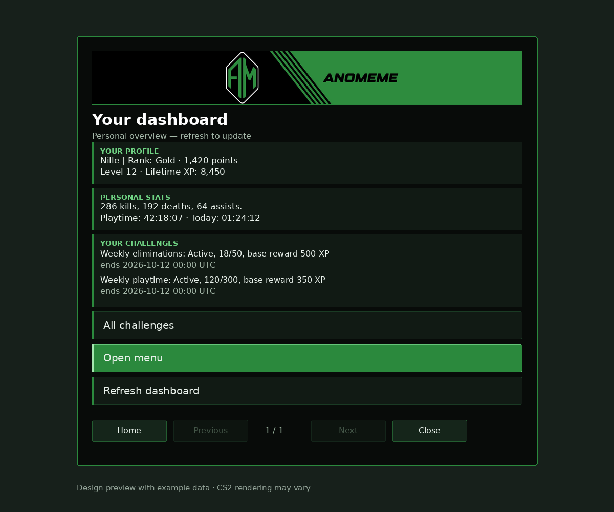

# AnoCore

AnoCore is a modular CS2 server plugin for community servers, regular game nights and organized matches. It combines player statistics, competitive ranks, levels and challenges, moderation, map voting and tournament management.



*Design preview, not an in-game screenshot. Player values are fictional. Fonts, spacing and navigation may differ from the current CS2 implementation; the current version separates Back from Prev/Next page. The dashboard requires a build containing the dashboard integration.*

## What can you do with it?

| Area | Capabilities |
| --- | --- |
| Player profile | View personal statistics, kills/deaths/assists, playtime and rank information |
| Ranks and ratings | Maintain rank points and leaderboards; compare connected players with AnoRating to help balance teams manually |
| Progression | Levels and XP, permanent achievements, scheduled challenges and XP boosts, independent of competitive rank points |
| Seasons | View the current season, its leaderboard and previous seasons |
| Community | Customize personal notifications and select authorized chat tags |
| Map voting | Start votes and interact with the native Panorama veto window |
| Tournaments | Configure two SteamID-based rosters and captains; manage BO1/BO3/BO5, readiness, map series, knife-round decisions, side selection, pauses and series scores |
| Administration | Permission-controlled player/server actions, roles, moderation, warnings and audit records |
| Integrations | Extend modules through the SDK; use the optional authenticated management connection and configurable moderation webhooks |

A community server can retain shared statistics and long-term progression. Regular game nights can use challenges and scheduled XP boosts. For organized matches, operators configure teams and control the match lifecycle. AnoRating assists manual team selection; it is not an automatic team balancer. Leetify is an optional external integration with separate API configuration.

**Development and testing status:** Automated checks do not replace CS2 server acceptance tests. Tournament events such as knife-round winners and map winners are reported through documented commands; this is not a fully automatic tournament platform. Available features and menus depend on enabled modules, permissions and the installed build. No battle pass is included. See the [acceptance matrix](docs/functional-acceptance.md) and [server test plan](docs/full-system-test.md).

## Installation

1. [Quick installation: Windows and DatHost](docs/quick-install.md)
2. [Server and database setup](docs/server-setup.md)
3. [Build and upload the Steam addon with its logo](docs/steam-addon.md)
4. [Connect the addon through MultiAddonManager](docs/server-setup.md#addon-and-multiaddonmanager)

The server plugin supplies logic and personal data. The Workshop addon supplies the interface. MultiAddonManager handles addon delivery and mounting. Plugin and UI versions must match for the native dashboard.

## Essential commands

Enter commands in game chat with `!`. Administrative commands require the appropriate permissions.

| Command | Purpose |
| --- | --- |
| `!anomenu` | Open the player interface; dashboard in builds containing that integration |
| `!anocommands` | List commands actually registered on the server and their usage |
| `!anostatsmenu` / `!anoranks` | Statistics or rank view |
| `!anoprogression` / `!anolevel` / `!anoxp` | Progression, level and XP |
| `!anochallenges` / `!anoachievements` | Challenges and achievements |
| `!anoseason` / `!anoseasons` / `!anoseasontopcurrent` | Season, history and current season leaderboard |
| `!anorating` | Ratings of connected players |
| `!anosettingsmenu` / `!anochatmenu` | Personal settings and chat tags |
| `!anoveto create` / `!anoveto` | Start a map vote or reopen it |
| `!anotournamentstatus` / `!anoready` | Match status or mark yourself ready |
| `!anostatus` | Check plugin startup and module status |

Details: [tournaments](docs/tournament.md), [challenges and XP](docs/progression.md), [moderation](docs/moderation-commands.md), [configuration reload](docs/configuration-reload.md), [management interface](docs/management-api.md) and [module SDK](docs/module-sdk.md).

## Development

.NET 10 SDK; CounterStrikeSharp API 374 or newer with a compatible .NET 10 host. The build dependency is CounterStrikeSharp.API 1.0.376.

```bash
dotnet restore AnoCore.sln
dotnet build AnoCore.sln -c Release --no-restore
dotnet test AnoCore.sln -c Release --no-build
dotnet format AnoCore.sln --verify-no-changes --no-restore
```

[Architecture](docs/architecture.md) · [Contributing](CONTRIBUTING.md) · [Project rules](AGENTS.md) · [Deployment](docs/deployment.md)

## License

GNU GPL v3.0. Copyright and attribution notices are preserved in [NOTICE.md](NOTICE.md) and [LICENSE.md](LICENSE.md).
